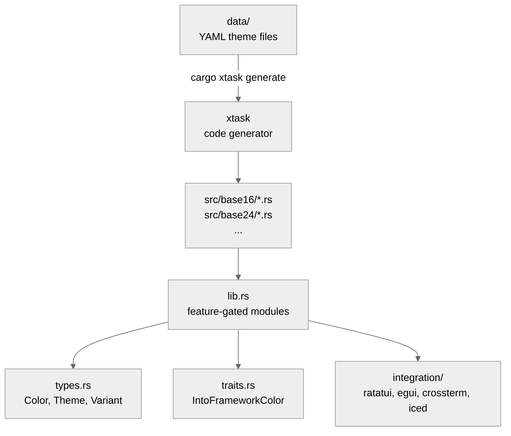

# chromata

**1000+ editor color themes as compile-time Rust constants.**

[](https://crates.io/crates/chromata)
[](https://docs.rs/chromata)
[](https://www.gnu.org/licenses/gpl-3.0)
[](https://thanks.dev/u/gh/resonant-jovian)

[](https://github.com/resonant-jovian/chromata/actions/workflows/ci.yml)
[]()

> [!IMPORTANT]
> Pre-1.0 — the API may change between minor versions. Pin your dependency version.

---

### Highlights

- **1000+ themes** — base16, base24, vim, emacs, and hand-curated ecosystems
- **Zero runtime cost** — every theme is a `const` struct, no parsing, no allocation
- **25+ semantic color roles** — bg, fg, keyword, string, function, error, and more
- **Feature-gated** — compile only the theme families you need (~20KB for `popular`)
- **Framework integrations** — ratatui, egui, crossterm, iced via optional features
- **`no_std` compatible** — works in embedded and WASM targets
- **WCAG contrast utilities** — luminance and contrast ratio calculations built in

---

## Contents

- [For Everyone](#for-everyone) — What chromata does, install, quick start
- [For Developers](#for-developers) — Architecture, traits, code generation pipeline
- [Feature Flags](#feature-flags) | [Development](#development) | [License](#license)

---

## For Everyone

Every Rust TUI, GUI, and terminal application needs colors. Most projects either hardcode hex values, copy-paste palettes from README files, or pull in a full theme engine with runtime parsing and file I/O. If you just want "give me the Gruvbox Dark background color," that's overkill.

**chromata** provides every popular editor and terminal color theme as compile-time `const` data. No file parsing. No runtime allocation. No dependencies by default. Add chromata to your `Cargo.toml`, reference a theme by name, and get colors at zero cost.

Each theme is a struct with named fields for semantic color roles — background, foreground, keyword, string, comment, error, plus a full accent palette. Themes are organized by family (base16, base24, vim, emacs) and feature-gated so you only compile what you use.

### Install

```toml
[dependencies]
chromata = "0.2.0"
```

Or with framework integration:

```toml
[dependencies]
chromata = { version = "0.2.0", features = ["ratatui-integration"] }
```

### Quick start

```rust
use chromata::popular::gruvbox;

fn main() {
    let theme = gruvbox::DARK_HARD;
    println!("Background: {}", theme.bg.to_css_hex()); // "#1d2021"
    println!("Keyword:    {}", theme.keyword.unwrap().to_css_hex());
    println!("Is dark?    {}", theme.is_dark());
}
```

### Generic theme parameter

```rust
fn render_ui(theme: &chromata::Theme) {
    let bg = theme.bg.to_css_hex();
    let fg = theme.fg.to_css_hex();
    println!("Rendering with bg={bg}, fg={fg}");
    if let Some(kw) = theme.keyword {
        println!("Keywords: {}", kw.to_css_hex());
    }
}

// Caller picks the theme:
render_ui(&chromata::popular::gruvbox::DARK_HARD);
render_ui(&chromata::popular::gruvbox::LIGHT);
```

### Theme discovery

```rust
use chromata::Variant;

let dark_themes: Vec<&chromata::Theme> = chromata::collect_all_themes()
    .into_iter()
    .filter(|t| t.variant == Variant::Dark)
    .collect();

println!("Found {} dark themes", dark_themes.len());
```

### Use cases

- **TUI applications** — ratatui, cursive, crossterm-based apps
- **GUI applications** — egui, iced, bevy, druid
- **Terminal emulators** — generate palette configurations
- **Syntax highlighting** — feed semantic colors into tree-sitter or similar
- **Theme preview tools** — compare themes side-by-side
- **CSS generation** — export custom properties for web frontends

---

## For Developers

### Architecture



### Module tree

```
src/
├── lib.rs            # Re-exports, feature gates, #![no_std]
├── types.rs          # Color, Theme, Variant, Contrast, Base16Palette, Base24Palette
├── traits.rs         # Framework integration traits
├── iter.rs           # collect_all_themes()
├── popular/          # Feature: "popular" (default) — curated 49 best themes
│   ├── mod.rs
│   ├── gruvbox.rs, solarized.rs, nord.rs, dracula.rs, ...
│   └── (24 family files, 49 themes total)
├── base16/           # Feature: "base16" — ~305 tinted-theming schemes
│   └── mod.rs
├── base24/           # Feature: "base24" — ~184 extended base16 schemes
│   └── mod.rs
├── vim/              # Feature: "vim" — ~600 vim colorschemes
│   └── mod.rs
├── emacs/            # Feature: "emacs" — ~200 emacs themes
│   └── mod.rs
└── integration/      # Optional framework conversions
    ├── mod.rs
    ├── ratatui.rs
    ├── egui.rs
    ├── crossterm.rs
    └── iced.rs
```

### The Theme struct

Every theme is a `const Theme` with metadata, UI colors, syntax colors, diagnostics, and a named accent palette:

```rust
pub struct Theme {
    // Metadata
    pub name: &'static str,
    pub author: &'static str,
    pub variant: Variant,        // Dark | Light
    pub contrast: Contrast,      // High | Normal | Low

    // Core UI
    pub bg: Color,
    pub fg: Color,
    pub cursor: Option<Color>,
    pub selection: Option<Color>,
    pub line_highlight: Option<Color>,
    pub gutter: Option<Color>,
    pub statusbar_bg: Option<Color>,
    pub statusbar_fg: Option<Color>,

    // Syntax
    pub comment: Option<Color>,
    pub keyword: Option<Color>,
    pub string: Option<Color>,
    pub function: Option<Color>,
    pub variable: Option<Color>,
    pub r#type: Option<Color>,
    pub constant: Option<Color>,
    pub operator: Option<Color>,
    pub tag: Option<Color>,

    // Diagnostics
    pub error: Option<Color>,
    pub warning: Option<Color>,
    pub info: Option<Color>,
    pub success: Option<Color>,

    // Accent palette
    pub red: Option<Color>,
    pub orange: Option<Color>,
    pub yellow: Option<Color>,
    pub green: Option<Color>,
    pub cyan: Option<Color>,
    pub blue: Option<Color>,
    pub purple: Option<Color>,
    pub magenta: Option<Color>,
}
```

### Trait system

Framework integrations use `From<Color>` conversions gated behind optional features:

```rust
// With the ratatui-integration feature:
use chromata::popular::gruvbox;

let style = ratatui::style::Style::default()
    .fg(gruvbox::DARK_HARD.fg.into())
    .bg(gruvbox::DARK_HARD.bg.into());
```

The generic traits `IntoFrameworkColor<T>` and `IntoFrameworkTheme<T>` allow framework-agnostic code when needed.

### Code generation pipeline

Themes are generated from upstream data files using `cargo xtask generate` (Strategy B — one-time generation, checked into git):

```
data/base16/*.yaml ──┐
data/base24/*.yaml ──┤──▶ cargo xtask generate ──▶ src/{family}/*.rs
data/vim/*.vim ──────┤
data/emacs/*.el ─────┘
```

The xtask reads structured data (YAML for base16/base24, normalized JSON for vim/emacs) and emits `.rs` files containing `const Theme` definitions. This avoids build-time parsing for downstream consumers.

---

## Feature Flags

| Feature | Themes | Description | Default |
|---------|--------|-------------|---------|
| `popular` | 49 | Curated best themes (gruvbox, catppuccin, nord, ...) | Yes |
| `base16` | 305 | Base16 themes from tinted-theming/schemes | No |
| `base24` | 184 | Base24 themes (extended base16 with 8 extra slots) | No |
| `vim` | 464 | Vim colorschemes from vim-colorschemes repos | No |
| `emacs` | 102 | Emacs themes from emacs-themes-site | No |
| `all` | 1104 | Enable all theme families | No |
| `ratatui-integration` | — | `From<Color>` for ratatui types | No |
| `egui-integration` | — | `From<Color>` for egui types | No |
| `crossterm-integration` | — | `From<Color>` for crossterm types | No |
| `iced-integration` | — | `From<Color>` for iced types | No |
| `serde-support` | — | Serialize/deserialize themes and colors | No |

---

## Development

```bash
cargo build                           # build with default features (popular)
cargo build --all-features            # build everything
cargo test                            # run tests
cargo xtask fetch                     # fetch upstream base16 YAML schemes
cargo xtask generate                  # generate themes from data/ YAML files
cargo clippy --all-features           # lint
cargo doc --no-deps --open            # browse API docs
```

```bash
# Run examples
cargo run --example list_all          # list all available themes
cargo run --example preview_ansi      # preview theme in terminal with ANSI colors
cargo run --example export_css        # generate CSS custom properties
```

---

## Minimum supported Rust version

Rust edition 2024, targeting **stable Rust 1.85+**.

## Support

If chromata is useful to your projects, consider supporting development via [thanks.dev](https://thanks.dev/u/gh/resonant-jovian).

## License

This project is licensed under the [GNU General Public License v3.0](https://www.gnu.org/licenses/gpl-3.0.en.html). See [LICENSE](LICENSE) for details.
